# 🕹️ The Glitch Zone - Plataforma Gamer 🎮

<!-- ⚡ CAPTURAS DE PANTALLA AGREGADAS -->
### 📸 Vista Previa del Proyecto

  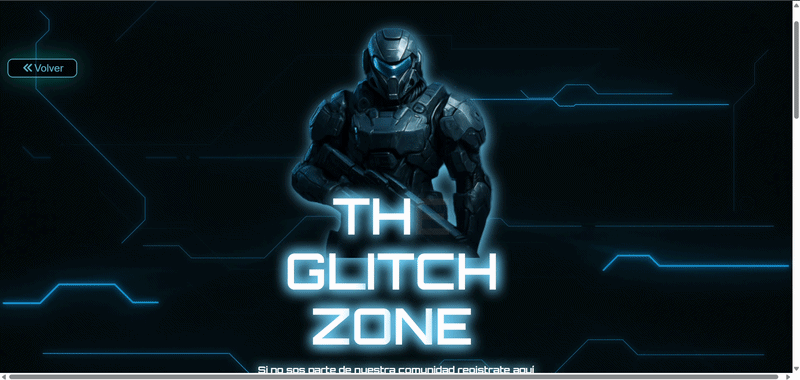

  

  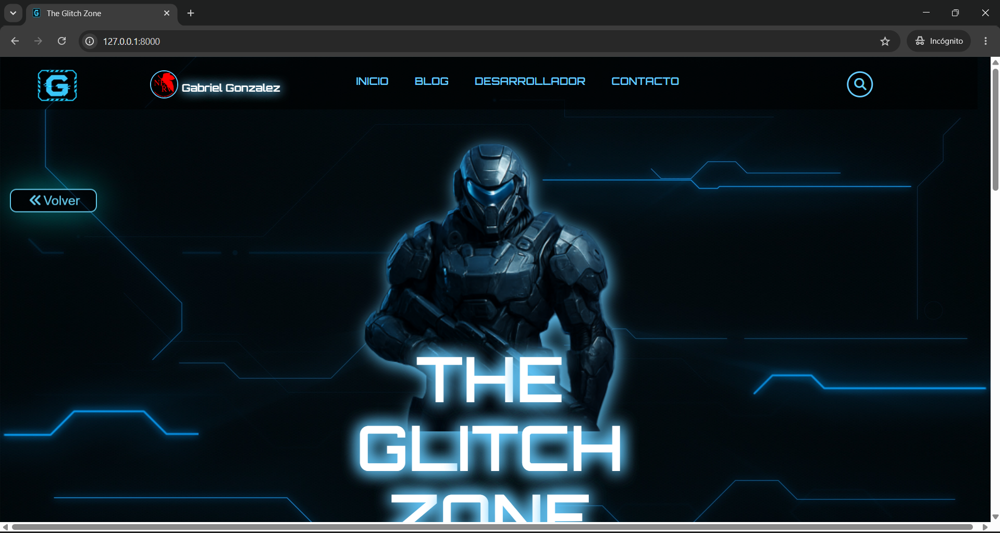
  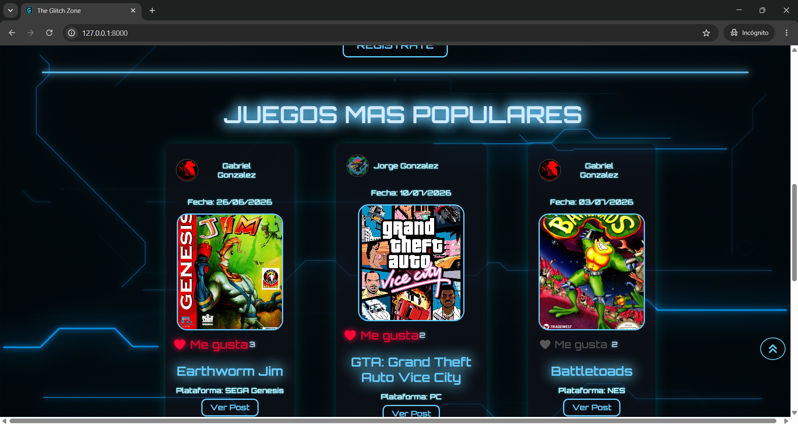
  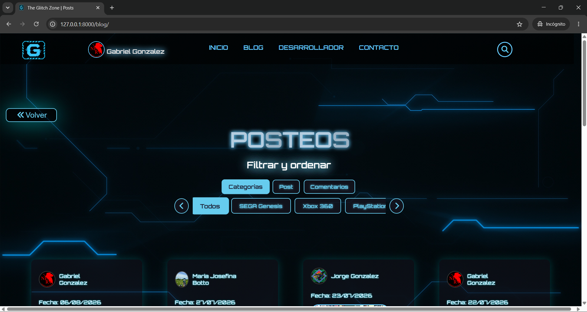
  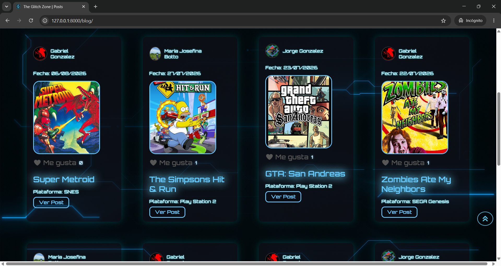
  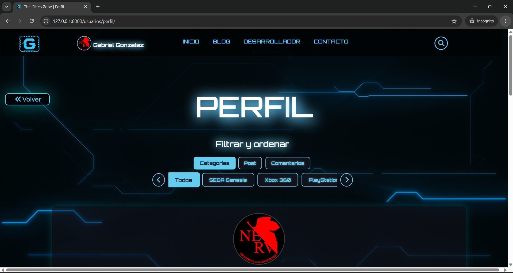
  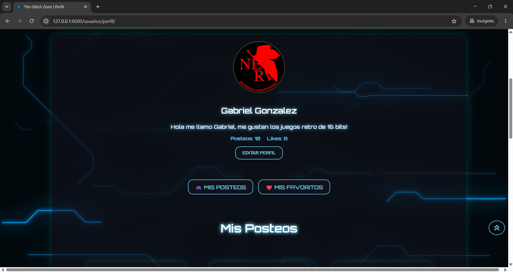
  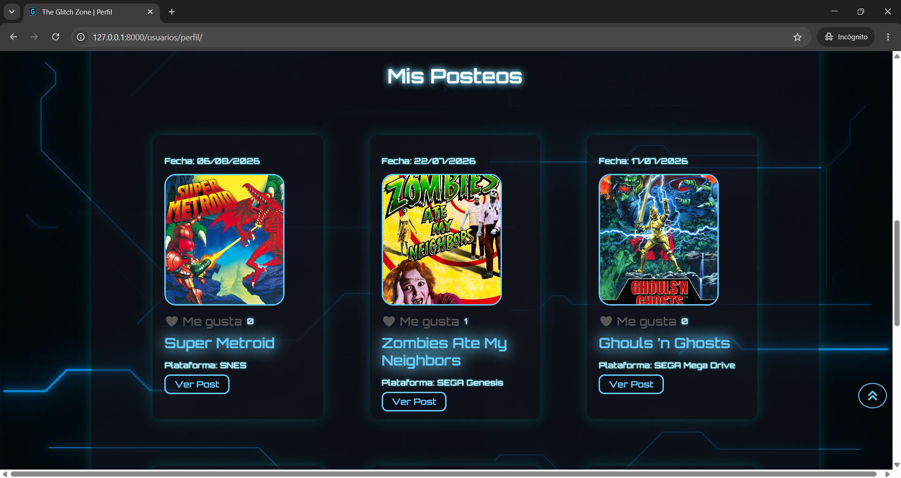
  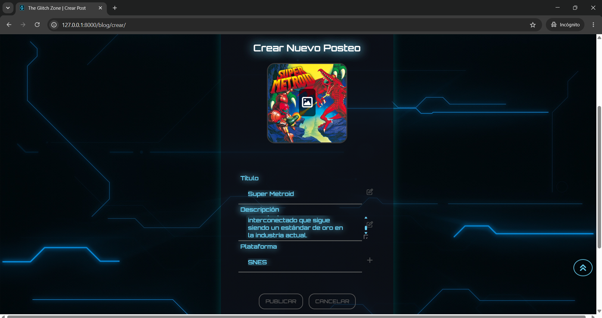
  ### 📱 Vista responsive
     
  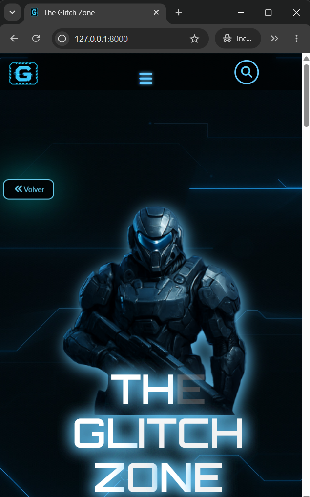
  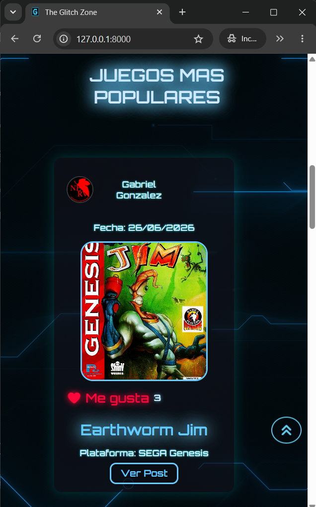
  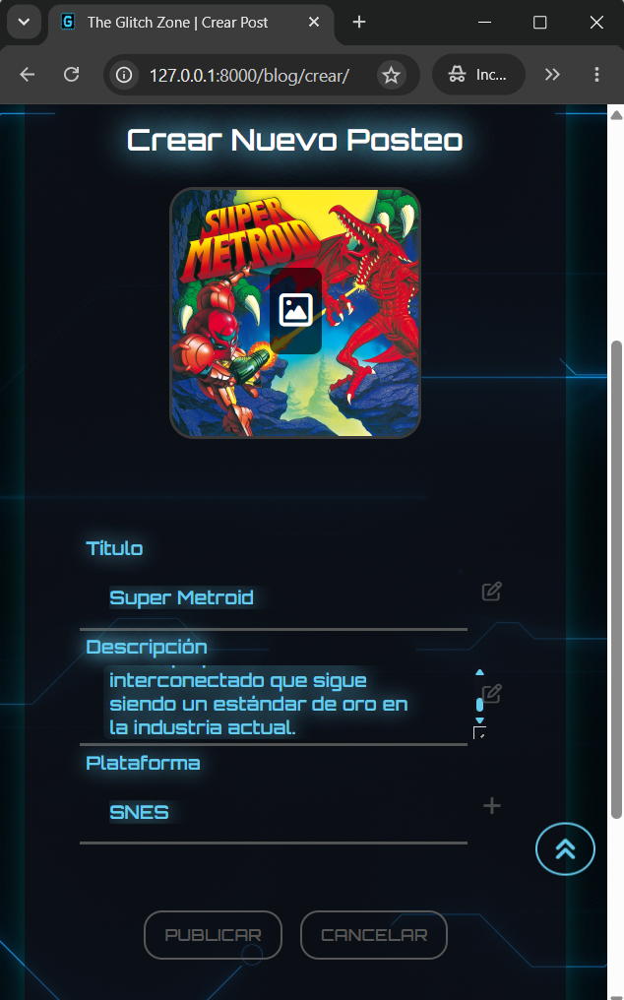

¡Bienvenido a **The Glitch Zone**! Una plataforma web y comunidad interactiva para amantes de los videojuegos, diseñada con una estética cyberpunk, neón y efectos glitch. 

Este proyecto fue desarrollado de forma independiente, abarcando desde el diseño de la base de datos relacional hasta la maquetación responsiva del frontend y la lógica del servidor.

---

## 🚀 Características Principales 

*   **Lógica de Portada:** Muestra de forma automática en la página de inicio los 3 posteos más recientes del blog y un podio con los 3 juegos que tienen más "Me gusta".
*   **Filtros por Servidor:** Panel con un carrusel que permite al usuario filtrar las publicaciones por categorías (plataformas) y ordenarlas por fecha o cantidad de comentarios a través de consultas en las vistas de Django.
*   **Paginación de Posteos:** Control de rendimiento que divide la grilla de juegos de a 8 registros por página para que la carga del sitio sea fluida.
*   **Likes con JavaScript (Fetch API):** Permite a los usuarios registrados dar o quitar su "Me gusta" en tiempo real sin necesidad de recargar la página entera, comunicándose con el servidor mediante peticiones asincrónicas.
*   **Mapeo de Comentarios:** Sección abajo de cada posteo donde los usuarios registrados pueden comentar y debatir. El sistema valida que el autor del comentario sea el único con permisos para gestionarlo o eliminarlo.
*   **Perfiles con Pestañas e Historial:** Panel individual que muestra los datos del usuario, su biografía, la cantidad de posts que subió y la suma de sus likes. Incluye dos botones para cambiar entre sus aportes y sus juegos favoritos, manteniendo el ID del usuario activo en la URL al cambiar de página.
*   **Formulario de Contacto:** Sección pública para que cualquier visitante deje su consulta. Los datos se validan, se guardan en una tabla de la base de datos y se pueden leer de manera ordenada desde el Panel de Administración de Django.
*   **Seguridad y Permisos:** Uso de herramientas nativas de Django como el decorador `@login_required` para bloquear rutas a usuarios anónimos, tokens CSRF contra alteraciones de formularios y condicionales en el HTML para ocultar botones de edición a terceros.

---

## 🛠️ Stack Tecnológico utilizado

*   **Backend:** Python, Django Framework (Arquitectura MVT, Vistas basadas en funciones).
*   **Frontend:** HTML5, CSS3 (Efectos neón, Flexbox, Maquetación Responsiva), JavaScript.
*   **Base de Datos:** SQLite.
*   **Herramientas & Entorno:** Git, GitHub, Django Admin Customization, Virtual Environments, VSCode.

---

## 👤 Creador
*   **José Gabriel González** - *Estudiante de desarrollo wed autodidacta / Trainee*
*   [Mi LinkedIn](https://linkedin.com) | [Mi GitHub](https://github.com/GabrielGonzalezBotto)
